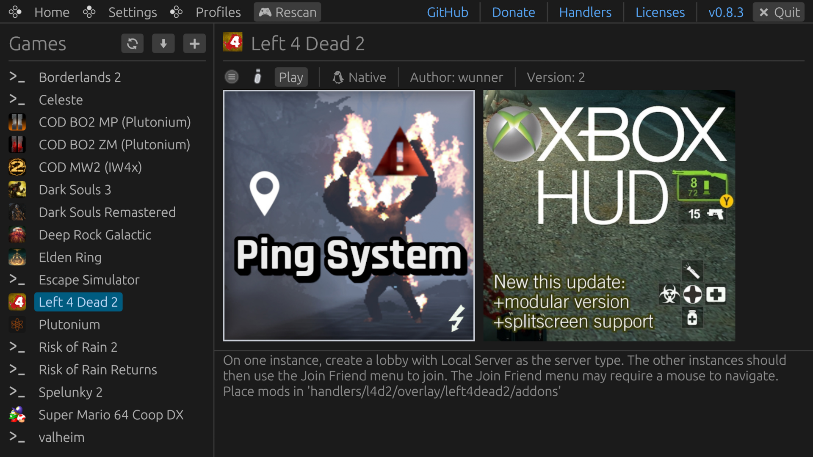
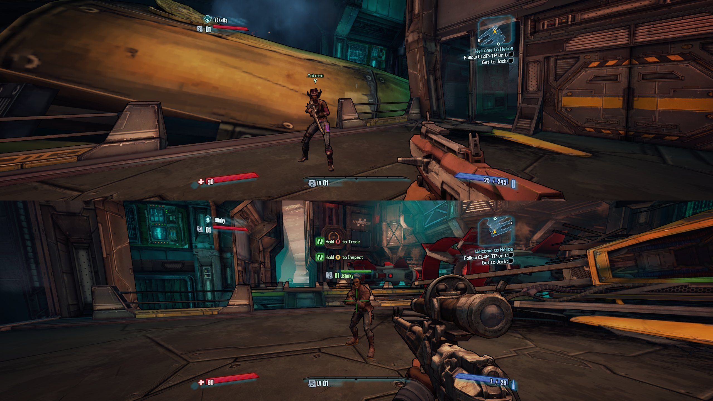

### `PartyDeck`

A split-screen game launcher for Linux and SteamOS.

---

<p align="center">
    
    
</p>

PartyDeck runs several copies of one game at the same time and tiles them on one screen. Each player gets their own controller, save data and profile. It works with native Linux games and, through Proton and UMU Launcher, with Windows games. Steam multiplayer is emulated so the copies can see each other over LAN.

> [!NOTE]
> PartyDeck is in early development. It may contain security flaws and rough edges; use at your own discretion. Advice and contributions are welcome.

Join the [Matrix server](https://matrix.to/#/#partydeck:matrix.org) for help, development discussion and feedback ([more information](https://github.com/partydeck/partydeck/issues/168)).

## Features

- Runs up to four game instances per monitor and tiles them automatically
- Native Linux games, plus Windows games through Proton-GE / UMU Launcher
- Handlers describe how to set up a game, so most games need little manual work
- Steam multiplayer API emulation (Goldberg), so several instances of a Steam game can play together
- Controllers work without drivers or extra software; keyboards and mice are supported too
- Each instance only sees the controller assigned to it
- Profiles give each player their own persistent saves, settings and stats
- Works out of the box on SteamOS

## Installing

Releases are at https://github.com/jackhric/partydeck/releases. Game handlers are [here](https://drive.proton.me/urls/D9HBKM18YR#zG8XC8yVy9WL).

### Steam Deck / SteamOS

1. Download `partydeck-<version>-steamdeck-x86_64.tar.gz` and extract it somewhere in your home folder.
2. In Desktop Mode, run `partydeck`.
3. For Gaming Mode, add `GamingModeLauncher.sh` from the extracted folder to Steam as a non-Steam game, then disable Steam Input in that shortcut's settings.

You need SteamOS 3.7 or newer.

### Desktop Linux

Download `partydeck-<version>-anylinux-x86_64.AppImage`, make it executable and run it. The AppImage bundles gamescope, UMU, bubblewrap and fuse-overlayfs, so no extra packages are needed. The tarball also works on any distribution that has those installed.

### Getting started

Click `+` to add a game, or the import button to load a PartyDeck handler package (`.pd2`). Create profiles if you want per-player save data, then look through the settings.

## How it works

- **Launcher (`partydeck`)**: the desktop app. Manages handlers, profiles and input devices, and starts a session.
- **Compositor (`partydeck-comp`)**: a small nested Wayland compositor that owns one window and tiles the game instances inside it. See [docs/compositor.md](docs/compositor.md).
- **One gamescope per player**: each game instance runs inside its own nested gamescope (`gamescope-kbm`, a fork with keyboard and mouse routing), which connects to a per-player socket on the compositor. Bubblewrap hides the other players' input devices and binds per-profile save folders.
- **Overlay (`cef-overlay`)**: a transparent HTML HUD, rendered by CEF and drawn above the slots by the compositor. See [docs/overlay.md](docs/overlay.md).
- **Proxy gamepads**: each instance gets a stable virtual gamepad that PartyDeck owns. Input from the real controller is forwarded to it, so Steam Input can reconnect devices without the game losing its pad.

Windows games run through UMU Launcher and Proton. Games that use the Steam API for multiplayer get Goldberg Steam Emu, which lets the instances find each other, and other machines on the LAN.

## Building

You need a Rust toolchain (2024 edition), `pnpm`, `make`, `meson`, `ninja`, `7z` and gamescope's build dependencies. Clone with submodules:

```
git clone --recurse-submodules https://github.com/jackhric/partydeck.git
cd partydeck
```

Native build of the full release layout into `build/holo/release/`:

```
make -C overlay ui
packaging/scripts/build_dist.sh
```

For everyday development, `packaging/scripts/dev.sh` downloads the third-party pieces and links them into `target/debug/`, after which `cargo run -p partydeck` works.

Release artifacts are built against SteamOS in Docker (the overlay page is built on the host first):

```
make -C overlay ui
docker build -t partydeck-build -f packaging/Dockerfile .
docker run --rm -v "$PWD:/workspace" partydeck-build bash packaging/scripts/build_all.sh
```

See [packaging/README.md](packaging/README.md) for what each script does.

## Repository layout

| Path | Contents |
|---|---|
| `crates/partydeck` | The launcher app |
| `crates/partydeck-comp` | The nested compositor |
| `crates/comp-proto` | Shared layout and IPC types used by both |
| `overlay/` | CEF overlay shell (C) and its React UI |
| `packaging/` | Dockerfile, build scripts, AppImage and SteamOS files |
| `res/` | Runtime data shipped with the app (avatars) |
| `deps/` | gamescope submodule and patch; downloaded deps land in `deps/releases/` |
| `docs/` | Design notes and images |

## Known issues

- AppImages and Flatpaks are not supported as game executables. Handlers can only run regular executables inside folders.
- Games using Goldberg may not find LAN games on other devices. Try adding a firewall rule for port 47584. Two Steam Decks on one LAN should not both keep the default hostname "steamdeck".

## Contributing

Bug reports and feature requests go in [issues](https://github.com/jackhric/partydeck/issues). Discussion happens on the [Matrix server](https://matrix.to/#/#partydeck:matrix.org). If you want to support the project, see the Sponsor button on GitHub (Ko-fi: wunner).

## Credits

- [@wunnr](https://github.com/wunnr) for starting PartyDeck
- [@Blahkaey](https://github.com/blahkaey) for helping to maintain PartyDeck and the community
- [@davidawesome02-backup](https://github.com/davidawesome02-backup) for the [gamescope keyboard/mouse fork](https://github.com/davidawesome02-backup/gamescope), and Valve for gamescope
- [@Twig6943](https://github.com/Twig6943) for work on AppImage packaging
- [@blckink](https://github.com/blckink) for contributions
- MrGoldberg and Detanup01 for [Goldberg Steam Emu](https://github.com/Detanup01/gbe_fork/)
- GloriousEggroll and contributors for [UMU Launcher](https://github.com/Open-Wine-Components/umu-launcher)
- Inspired by [Tau5's Co-op on Linux](https://github.com/Tau5/Co-op-on-Linux) and [Syntrait's Splinux](https://github.com/Syntrait/splinux)
- Talos91 and the Splitscreen.me team for [Nucleus Co-op](https://github.com/SplitScreen-Me/splitscreenme-nucleus), and for help with handler creation

## Disclaimer

This software has been created purely for the purposes of academic research. It is not intended to be used to attack other systems. Project maintainers are not responsible or liable for misuse of the software. Use responsibly.
